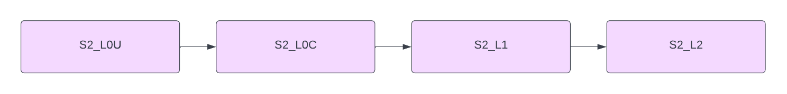

:arrow_heading_up:
Go back to the
[Reference System Software repository](https://github.com/COPRS/reference-system-software)
:arrow_heading_up:

---

# Processing Sentinel 2

<!-- TOC -->
* [Processing Sentinel 2](#processing-sentinel-2)
  * [Overview](#overview)
  * [Available RS Addons](#available-rs-addons)
  * [Installation](#installation)
    * [Prerequisites](#prerequisites)
    * [Build](#build)
    * [Repository content](#repository-content)
    * [Using Ansible](#using-ansible)
    * [Manual Install](#manual-install)
    * [Uninstall](#uninstall)
<!-- TOC -->

## Overview

This repository contains components for the Sentinel 2 processing chain.  
They are grouped by processing level, and deployed using a separate rs-addon for each level.

Each rs-addon includes : preparation worker, execution worker(s) and internal interface management
with rs-core components and Object Storage.

Basic workflow :  


- The S2_L0U addon consumes Session data to produce basic datastrips/granules, SAD, and HKTM files.
- The S2_L0C addon uses the output of S2_L0U to produce L0 products.

For more information: [Sentinel 2 website](https://sentinels.copernicus.eu/web/sentinel/missions/sentinel-2).

## Available RS Addons

- [S2_L0U](rs-addons/S2_L0U)
- [S2_L0C](rs-addons/S2_L0C)

## Installation

Each RS-Addon will provide its own specific installation instructions, which may be found in their respective directory (see [above](#available-rs-addons)).

### Prerequisites

- Infrastructure : all the required tools (such as Kafka and MongoDB) are included in the RS infrastructure installation.  
  See  [Reference System Software Infrastructure](https://github.com/COPRS/infrastructure) for details.
- RS-Core : all the required components can be found in the following repositories :
    - [Production-Common](https://github.com/COPRS/production-common) (Ingestion, Catalog)
    - [Monitoring](https://github.com/COPRS/monitoring) (Processing monitoring & reporting)

### Build

In order to build the project from source, first clone the GitHub repository :

```shellsession
git clone https://github.com/COPRS/processing-sentinel-2.git
```

Then build the docker images:

```shellsession
./gradlew clean build bootBuildImage docker
```

And finally build the zip files:

```shellsession
./rs-addons/build_addons.sh
```

The zip files will be found in the rs-addons folder.

### Repository content

For each RS-Addon, the artifactory repository should contain:

- Docker images for the custom components of the addon in:  
  https://artifactory.coprs.esa-copernicus.eu/ui/repos/tree/General/rs-docker-private
- A zip file (its name includes the version number) for the addon in:  
  https://artifactory.coprs.esa-copernicus.eu/ui/repos/tree/General/rs-zip-private

### Using Ansible

Run the `deploy-rs-addon.yaml` playbook with the following variables:

- **stream_name**: name given to the stream in *Spring Cloud Dataflow*
- **rs_addon_location**: direct download url of the zip file or zip location on the bastion

Example:

```shellsession
ansible-playbook deploy-rs-addon.yaml \
    -i inventory/mycluster/hosts.yaml \
    -e rs_addon_location=https://artifactory.coprs.esa-copernicus.eu/artifactory/demo-zip/demo-rs-addon.zip \
    -e stream_name=example-stream-name
```

### Manual Install

Download and extract the zip file for the RS-Addon to install.  
If necessary, edit the parameters as required (See the specific addon release note for parameters description).

- Create all objects defined by files in _Executables/additional_resources_
- Using the SCDF GUI:
    - Register the applications using the content of the _stream-application-list.properties_ file
    - Create the streams using the content fo the _stream-definition.properties_ file
    - Deploy the stream using the properties defined in the _stream-parameters.properties_ file (removing comments)

### Uninstall

Using the SCDF GUI, undeploy then destroy all the streams relative to the RS-Addon.
