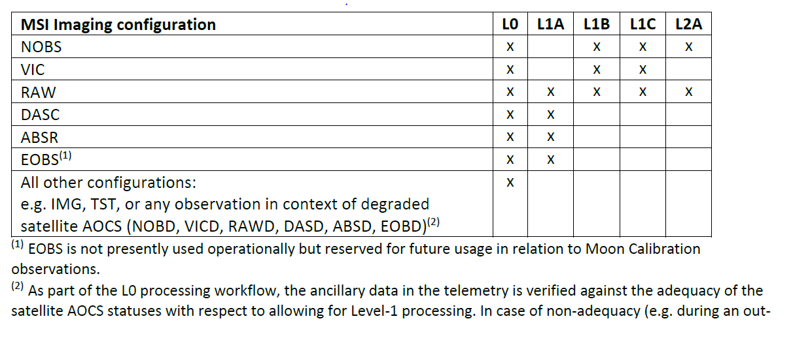
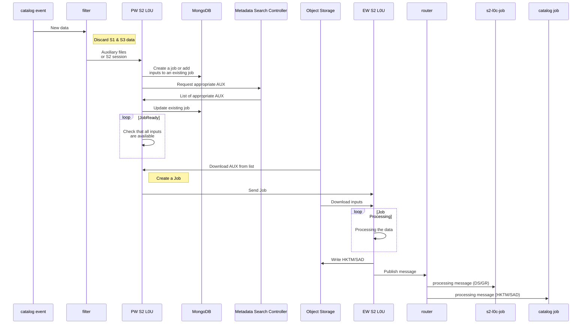
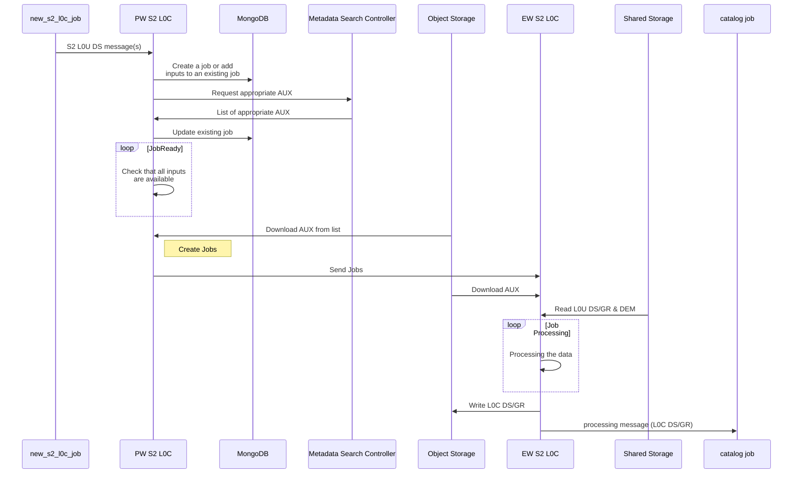
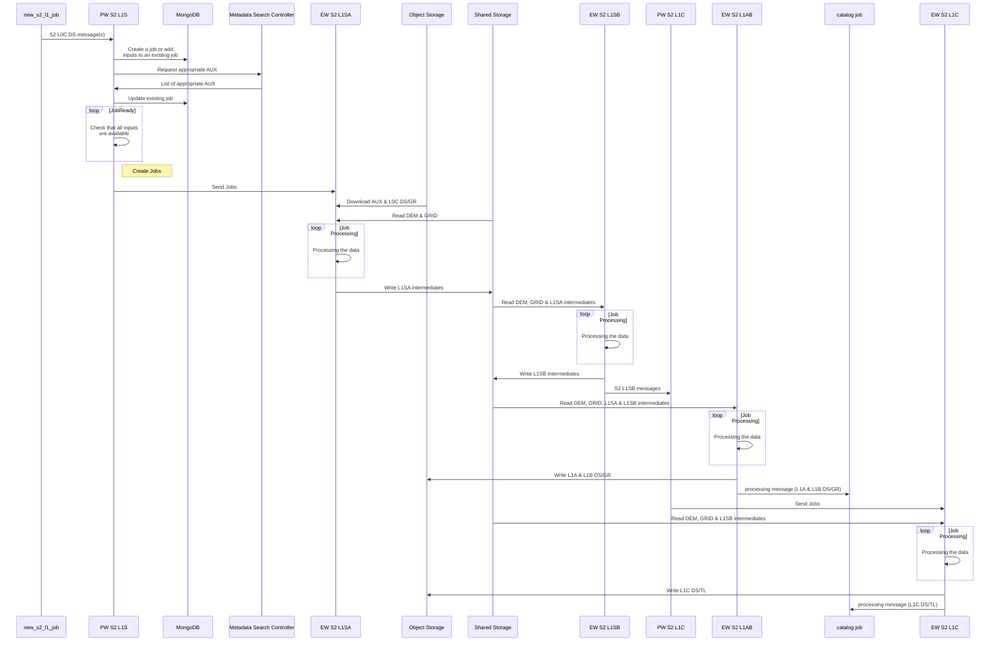
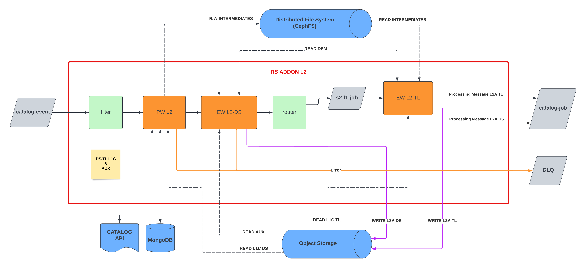
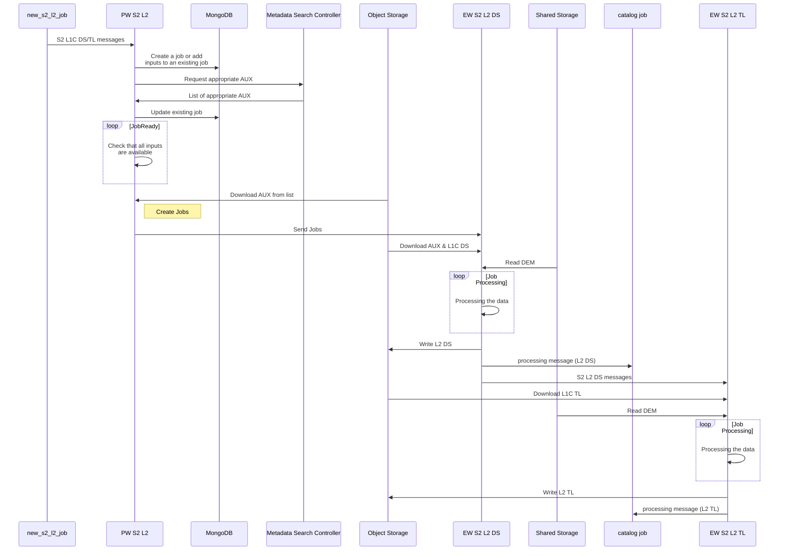

### Copernicus Reference System
# Processing Sentinel 2 - Architecture Design Document
### Reference System version V2.0
---
### Document Summary

This document is the **A**rchitecture **D**esign **D**ocument (ADD) for the **S**entinel-**2** (S2) processing of **R**eference **S**ystem **S**oftware (RS Software). This document will be completed all along the software development lifecycle.

For the moment, there is only the level 0 available because the level 1 & 2 are coming in the next versions.

### Document Change Log

| Issue/Revision |    Date     | Change Requests                                         | Observations            |
| :------------: | :---------: | ------------------------------------------------------- | ----------------------- |
|  1.0 draft 1   | 06 Sep 2022 |                                                         | First issue of document |
|  1.0 draft 2   | 16 Sep 2022 | Update document based on feedbacks from internal review |                         |
|  1.2 draft 1   | 21 Nov 2022 | Update document for Level 1                             |                         |

### Table Of Contents

- [Processing Sentinel 2 Architecture Design Document](#processing-sentinel-2-architecture-design-document)
  - [Document](#document)
    - [Document properties](#document-properties)
    - [Document Summary](#document-summary)
    - [Document Change Log](#document-change-log)
    - [Table Of Contents](#table-of-contents)
  - [Introduction](#introduction)
    - [Scope](#scope)
    - [Applicable and Reference Documents](#applicable-and-reference-documents)
      - [Applicable documents](#applicable-documents)
      - [Reference documents](#reference-documents)
      - [Glossary](#glossary)
  - [Software Design](#software-design)
    - [Overview](#overview)
    - [RS addons](#rs-addons)
      - [S2\_L0U](#s2_l0u)
      - [S2\_L0C](#s2_l0c)
      - [S2\_L1](#s2_l1)
      - [S2\_L2](#s2_l2)

## Introduction

The Architecture Design Document (ADD) describes the overall architectural design and the detailed design of each component. Internal interfaces design is also included in this document.

This document is inspired by the ECSS Template of the SDD.

### Scope

The Architecture Design Document is applicable to the processing of Sentinel 2, part of the Reference System Project.

### Applicable and Reference Documents

#### Applicable documents

| Reference                | Issue no | Title of document                                                 |
| ------------------------ | :------: | ----------------------------------------------------------------- |
| COPRS-ICD-ADST-001144532 |   5.0    | Interface Control Document Processing Message format              |
| COPRS-ICD-ADST-001133963 |   5.0    | Interface Control Document  Reference System add-on               |
| CORPS-ICD-ADST-001139201 |   6.0    | Interface Control Document Reference System core                  |
| COPRS-ICD-ADST-001048446 |   3.0    | Interface Control Document Reference System Trace format          |
| COPRS-ICD-ADST-001363642 |   3.0    | Interface Control Document Reference System Trace tailored format |
| COPRS-ICD-ADST-001048444 |   2.0    | RS Log Interface Control Document                                 |
| CORPS-ICD-ADST-001406842 |   1.0    | Interface Control Document Reference System S3 Object Storage     |

#### Reference documents

|       Acronym       |        Reference         | Issue no | Title of document                                  |
| :-----------------: | :----------------------: | :------: | -------------------------------------------------- |
| [ SVVD PS2 COPRS ]  | CSGF-CSC-RS-TST-SVVD-PS2 |   1.0    | Software Verification and Validation Test Document |
| [ ADD INFRA COPRS ] |  CSGF-CSC-RS-PRD-ADDINF  |   2.0    | Architecture & Design Document Infrastructure      |

#### Glossary

| Term | Definition                                     |
| ---- | ---------------------------------------------- |
| ADD  | Architecture Design Document                   |
| DS   | Datastrip                                      |
| ECSS | European Cooperation for Space Standardization |
| GR   | Granules                                       |
| HMI  | Human Machine Interface                        |
| ICD  | Interface Control Document                     |
| L0   | Level 0                                        |
| L0U  | Level 0 Unconsolidated                         |
| L0C  | Level 0 Consolidated                           |
| L1   | Level 1                                        |
| L2   | Level 2                                        |
| PRIP | Production Interface Delivery Points           |
| SCDF | Spring Cloud Data Flow                         |
| SDD  | Software Design Document                       |
| TL   | Tiles                                          |

## Software Design

### Overview

The S2 processing is split in several parts, also called rs-addon, corresponding to a group of one or several processors that are capable to generate different levels of processing (L0, L1, L2).

Each rs-addon includes : preparation worker, execution worker(s) and internal interface management with rs-core components and Object Storage.

The S2 **L**evel **0** (L0) processing is then composed of 2 rs-addons :

- The S2_L0U addon consumes Session data and auxiliary files to produce basic datastrips/granules, SAD, and HKTM files.
- The S2_L0C addon uses the output of S2_L0U and auxiliary files to produce L0 products.
- The S2_L1 addon uses the output of S2_L0C, auxiliary files, DEMs and GRID to produce L1 products.
- The S2_L2 addon uses the output of S2_L1, auxiliary files and DEMs to produce L2 products.

The input of one rs-addon is always a message in a kafka topic from the Metadata Catalog (with the exeption of the S2 L0C rs-addons). This message is commonly called a *catalog event* and is generated by the rs-core [Metadata](https://github.com/COPRS/production-common/tree/release/1.5.0/processing-common/metadata) from the production-common's repository. This message must be compliant with the ICD Processing Message format.

When new data is available, new messages are published in kafka and the rs-addon uses a SCDF filter to trigger or not new processings based on the mission (Sentinel 1, 2 or 3) and the level (L0, L1 or L2).

The processing of the L1 and/or L2 depends on the datatake type as described in the picture below:

**Values**: INS-NOBS (nominal observation), INS-EOBS (extended observation), INS-DASC (dark signal calibration), INS-ABSR (absolute radiometry calibration), INS-VIC (vicarious calibration), INS-RAW (raw measurement), INS-TST (test mode)

The output of one rs-addon is one or more [intermediate and/or end-user products][fn_s2_products] :

- S2_L0U
  - PRD_HKTM
  - AUX_SADATA
  - Unconsolidated Datastrip(s)
  - Unconsolidated Granules
- [S2_L0C][fn_s2_l0]
  - Consolidated Datastrip(s)
  - Consolidated Granules
- [S2_L1A][fn_s2_l1a]
  - Datastrip(s)
  - Granules
- [S2_L1B][fn_s2_l1b]
  - Datastrip(s)
  - Granules
- [S2_L1C][fn_s2_l1c]
  - Datastrip(s)
  - Tiles
- [S2_L2A][fn_s2_l2a]
  - Datastrip(s)
  - Tiles

[fn_s2_products]: https://sentinel.esa.int/web/sentinel/user-guides/sentinel-2-msi/processing-levels "Sentinel 2 Processing Levels"
[fn_s2_l0]: https://sentinel.esa.int/web/sentinel/technical-guides/sentinel-2-msi/level-0-processing "Level-0 Consolidation Processing"
[fn_s2_l1a]: https://sentinel.esa.int/web/sentinel/technical-guides/sentinel-2-msi/level-1a-processing "Level-1A Processing Overview"
[fn_s2_l1b]: https://sentinel.esa.int/web/sentinel/technical-guides/sentinel-2-msi/level-1b-processing "Level-1B Processing Overview"
[fn_s2_l1c]: https://sentinel.esa.int/web/sentinel/technical-guides/sentinel-2-msi/level-1c-processing "Level-1C Processing Overview"
[fn_s2_l2a]: https://sentinel.esa.int/web/sentinel/technical-guides/sentinel-2-msi/level-2a-processing "Level 2A Processing Overview"

The rs-addon uploads the end-user products in the object storage, publishes new messages in kafka. Then, several rs-cores handle the products, add them in the metadata catalog and publish them in the PRIP so an end-user can download them.

### RS addons

#### S2_L0U

Here below's the S2 L0U workflow schema:

Here below's a sequence diagram ([click here in case it is not rendering](https://mermaid.live/edit#pako:eNp1VNFO20AQ_JWVH6oiEYXSN6uKlMZRKwo0ihvRh7ysfRvn6PnWPZ-BCPHv7MUJcYjx08k3MzszvvNzlLOiKI5q-t-QzSnRWDgslxbkydGj4QLogawfjEYrbTy5GG7pEZTstahb9gROF2sPvII9JtF1jk5B-gU-Qfq1g28RIje7g_QSri8WMYybJ200uk3YpRq-ZW44Yhf2a6przbblvlGEfsO24OR7DBNHKBYQ7jkDIaFSrYC2VeNr8AxogZ507bUtAqpHjDwGi5ASunwNE7besTEhyjx0U3vAqnJcOR2GjRd_W5GPiccJr2V66KdXpDfWolIBdOrbMFdwxdmcUG3aV-9FOoMna8r_gV-jBDAGdp1s-0EnrT2gNpgZaoXIqnbxO7un3EPq2WFBx5IJP1rDqEIAWDkuwYjHvtPQ9bH_Sld9_U8PwFQ8HEAnPqY9PtpQx-3AzHEezo4tDh1N-0ceoFIUdc7qWx1d4rGlGO6clmA_f_25Gabj5BTvuNleiVmTSU9rKGWUEFtguymo-nJgLvKBfOUYqoOfHRg-J-nwx_zsHWl_Qz9k7V2dRedRSa5EreS2PweZZSRZS1pGsSwVrbAxfhkt7YtAm-3ZmyotGaN4haam8wgbz-nG5lHsXUN70O6PsUO9vAKD0l_g)):

*Missing Outputs*: If the L0u processing fails, the number of missing outputs is estimated, for datastrips only, based on the number produced on average. This number is currently 6.

#### S2_L0C

Here below's the S2 L0C workflow schema:

Here below's a sequence diagram ([click here in case it is not rendering](https://mermaid.live/edit#pako:eNp1U9Fq20AQ_JXlHkoCKQl5FMXQWqJQkjZYmPRBYFa6tXTp6VY9nZqGkH_vyufEcqzqRYc0Ozszu_esKtakEtXT74FcRanB2mNbOJDH0eOmv97Yq2rzwOXHxeLuHvJruLlaJvG9hjSHlvoeazrrz2PVG0gKbtnVnH5JYOkJAwGCEAF7QK3hU-kvF8Z1Q-ghMKAD-mv6YFw9ombIKKDGgJAT-qqBJbvg2VryCaxG_X0A7DrPnTdjs8_rn5Hk_4XHnm6kO_B2nmTW1rrTI-hUt2Xu4BuXK0L9FD-9J5k0XjZU_YLQoBiwFvaZ7PJBL6n9QWOxtBSJyOl4-FE-UBUgD-xlAMeUKT86y6hHA7D13IIVjbHuO4tmb-pm53aqI05JdPenprPJ8EXCBHWiI5vXEdF5I570PHqMa79Xl19X8AHS7PY4ULjzXMnGSdqHWLN5mQeoZEswrsC7BKeFxy4SuPdGspB_UcxpQSV8lndDT6A79NpfCDh7qz1XF6ol36LRcteeR6pCiaSWCpXIUdMWBxsKVbgXgQ67rcq0ESkq2aLt6ULhEDh_cpVKgh_oFbS_r3vUyz9vMy5M)):

*Missing Outputs*: If the L0c processing fails, the number of missing outputs for datatstrips and granules is the same as the number of L0u datastrips and granules used as input.

#### S2_L1

Here below's the S2 L1 workflow schema:

Here below's a sequence diagram ([click here in case it is not rendering](https://mermaid.live/edit#pako:eNqdVV1r2zAU_SsXDUoLGV37aEYgtkPZSLcSr3QPgaBYN4k7WfIkeV0p_e-7_sj8lbRp_WJh33PuOUdX9hOLtUDmMYu_c1QxhgnfGJ4uFNCl8GFpL5fyYnmvVx_H45s7iC5hdhF55f1TAGEEKVrLN3hqzyrQ_yICXGu10aHvQWCQOwQORATaABcCPq_M-ThRWe4sOA1cAf5NrEvUpqjaQ4aOC-44RMhNvIVAK2e0lGg8mBfyrQOeZUZnJimaTW5_ViSHgV1PM-oOer2fZK-t20wURUPdUusMvurVHLl4rB71SVqNgy3Gv8BtORmQEupMyny4odT-8ETylcSKCJWoFh--r-4xdhA5bWgHupyhflBSc1E4gLXRKUgSWQG_aRJtks22tNsWUm0TCbdD19PdekLbTyJaZQMh7dqOkpN6bM6v5hU02pJFcQBaxAfh9JpgV_MvYTdbuDE6puGj4JuEG3SPqimmoBGKeejF2YF2ZXlwZxIKpnhJ2-PQpCiK-bCvmfAbE6PSQ5HAAZbjjPk9-jcY818y5u-T1IHuhiHwdg93h_-1GCaDGEZVCicHOx8VxsTvNTk-jBLandsmjEqY357TDi4mXqnL8-5B1vSs44DTHkXv0xi0VAeDw3QwxWD_LL0_vp6O48MLXsiuPN0_ZkPAEaHV2DM2Yik54omgX9NTQbVgJCnFBfNoKXDNc-kWbKGeqTQvv8JTkZAU5q25tDhiPHc6elQx85zJcVdU_97qqud_lOodvQ)):

*Missing Outputs*: If the L1S1, L1SB or the L1AB processing fails, the number of missing outputs for datatstrips and granules is the same as the number of L0c datastrips and granules used as input. If a L1C processing fails, the number of missing outputs for tiles is 1, as the tiles are processed one by one.

#### S2_L2

Here below's the S2 L2 workflow schema:

Here below's a sequence diagram ([click here in case it is not rendering](https://mermaid.live/edit#pako:eNqdlEtv2zAQhP_KgoeiAVIE9VEoDLS2L4HSBpGD9GDAWIlrSynFVSmqaRDkv3cpyQ_5gbbxxbQ8Mxx-JPWiMtakIlXTz4ZsRtMC1w7LhQX5WHpa1qOlGS0fOf0wHt8-QDKCeBS1Xx8nME2u5jGUVNe4prozbUSiv2G75umXCCaO0BMgSA6wA9QaPqXualzYqvE1eAa0QL-L2hd2HVTHWeRRo0dICF2Ww4Std2wMuQjuQvnaA1aV48oVYa7P99-7jPPGwYpimRt4dTrj1JruKx00x6UNcwXXnN4R6ufu0UHGbtZJTtkP8DlKeWOgx9GiQSfAfmFhMDXUxZDV3eBb-kiZh8SzE_CDxCk_WcOoQ3lYOS7BSMHO9pWlsCvWebvSvRbd9kjn4z2c9UPZa9l2abAnO6oxEA-avOvPS2dMclmdPmcM4GA6uxnihFvHmZw0Yb2Duuc7TNnJhS9BOAIHFIfm4WIieHCFMGn_PSXPJM9wu-0RVLu5-ssA71vhxSnr9tc8jrbPD27RebTBtEUboM7jv0ENlrdAnceHKf8BtTWfhbopPZT_C9R5fKEuVUmuxELLm-slBC2U1ClpoSIZalphY_xCLeyrSJv2os50ISVUtEJT06XCxnPybDMVedfQRtS__XrV6x_dJo6f)):

*Missing Outputs*: If the L2A processing fails, the number of missing outputs for datatstrips and tiles is the same as the number of L1C datastrips and tiles used as input.
