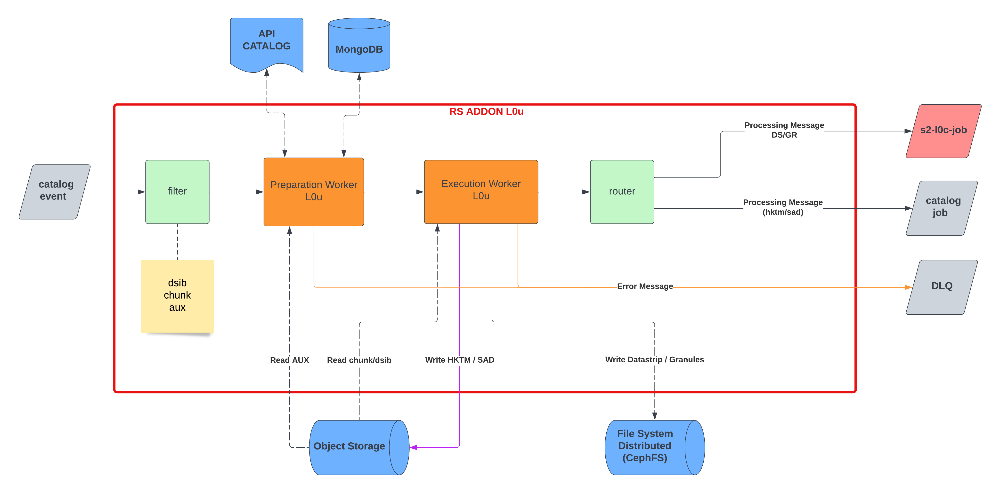
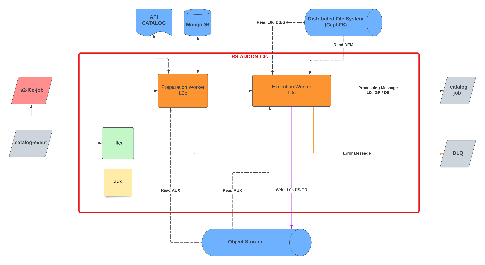

# Architecture Design Document

## Document Summary

This document is the **A**rchitecture **D**esign **D**ocument (ADD) for the **S**entinel-**2** (S2) processing of **R**eference **S**ystem **S**oftware (RS Software). This document will be completed all along the software development lifecycle.

## Document Change Log

| Issue/Revision | Date | Change Requests | Observations |
| :------------: | :--: | --------------- | ------------ |
| 1.0 | 06 Sep 2022 | | First issue of document |

## Table Of Contents

- [Introduction](#introduction)
  - [Scope](#scope)
  - [Applicable and Reference Documents](#applicable-and-reference-documents)
    - [Applicable documents](#applicable-documents)
    - [Reference documents](#reference-documents)
    - [Glossary](#glossary)
- [Software Design](#software-design)
  - [Overview](#overview)
  - [RS addons](#rs-addons)
    - [S2_L0U](#s2l0u)
    - [S2_L0C](#s2l0c)

# Introduction

The Architecture Design Document (ADD) describes the overall architectural design and the detailed design of each component. Internal interfaces design is also included in this document.

This document is inspired by the ECSS Template of the SDD.

## Scope

The Architecture Design Document is applicable to the Reference System Project.

## Applicable and Reference Documents

### Applicable documents

| Reference | Issue no | Title of document |
| --------- | :------: | ----------------- |
| COPRS-ICD-ADST-001144532 | 5.0 | Interface Control Document Processing Message format |
| COPRS-ICD-ADST-001133963 | 5.0 | Interface Control Document  Reference System add-on |
| CORPS-ICD-ADST-001139201 | 6.0 | Interface Control Document Reference System core |
| COPRS-ICD-ADST-001048446 | 3.0 | Interface Control Document Reference System Trace format |
| COPRS-ICD-ADST-001363642 | 3.0 | Interface Control Document Reference System Trace tailored format |
| COPRS-ICD-ADST-001048444 | 2.0 | RS Log Interface Control Document |

### Reference documents

| Acronym | Reference   | Issue no | Title of document |
| :-----: | :---------: | :------: | ----------------- |
| [ SVVD COPRS ] | CSGF-CSC-RS-TST-SVVD | 1 | Software Verification and Validation Test Document |
| [ ADD INFRA COPRS ] | CSGF-CSC-RS-PRD-ADDINF | 1 | Architecture & Design Document Infrastructure |

### Glossary

| Term | Definition |
| ---- | ---------- |
| ADD | Architecture Design Document |
| ECSS | European Cooperation for Space Standardization |
| HMI | Human Machine Interface |
| ICD | Interface Control Document |
| L0  | Level 0 |
| L0U  | Level 0 Unconsolidated |
| L0C  | Level 0 Consolidated |
| L1  | Level 1 |
| L2  | Level 2 |
| PRIP | Production Interface Delivery Points |
| SCDF  | Spring Cloud Data Flow |
| SDD | Software Design Document |

# Software Design

## Overview 
The S2 processing is split in several parts, also called rs-addon, corresponding to a group of one or several processors that are capable to generate different level of processing (L0, L1, L2).

Each rs-addon includes : preparation worker, execution worker(s) and internal interface management with rs-core components and Object Storage.

The S2 **L**evel **0** (L0) processing is then composed of 2 rs-addons :

- The S2_L0U addon consumes Session data and auxiliary files to produce basic datastrips/granules, SAD, and HKTM files.
- The S2_L0C addon uses the output of S2_L0U and and auxiliary files to produce L0 products.

The input of one rs-addons is always a message in a kafka topic from the Metadata Catalog (with the exeption of the S2 L0C rs-addons). This message is commonly called a *catalog event* and is generated by the rs-core [Metadata](https://github.com/COPRS/production-common/tree/release/1.5.0/processing-common/metadata) from the production-common's repository. This message must be compliant with the ICD Processing Message format.

When new data is available, new messages are published in kafka and the rs-addon uses a SCDF filter to trigger or not new processings based on the mission (Sentinel 1, 2 or 3) and the level (L1, L1 or L2).

The output of one rs-addons is one or more intermediate and/or end-user products :
- S2_L0U
  - PRD_HKTM
  - AUX_SADATA
  - Unconsolidated Datastrip(s)
  - Unconsolidated Granules
- S2_L0C
  - Consolidated Datastrip(s)
  - Consolidated Granules

The rs-addon uploads the end-user products in the object storage, publishes new messages in kafka. Then, several rs-cores handle the products, add them in the metadata catalog and publish them in the PRIP so an end-user can download them.

## RS addons

### S2_L0U

Here below's the S2 L0U workflow schema:

Here below's a sequence diagram ([click here in case it is not rendering](https://mermaid.live/edit#pako:eNp1VNFO20AQ_JWVH6oiEYXSN6uKlMZRKwo0ihvRh7ysfRvn6PnWPZ-BCPHv7MUJcYjx08k3MzszvvNzlLOiKI5q-t-QzSnRWDgslxbkydGj4QLogawfjEYrbTy5GG7pEZTstahb9gROF2sPvII9JtF1jk5B-gU-Qfq1g28RIje7g_QSri8WMYybJ200uk3YpRq-ZW44Yhf2a6przbblvlGEfsO24OR7DBNHKBYQ7jkDIaFSrYC2VeNr8AxogZ507bUtAqpHjDwGi5ASunwNE7besTEhyjx0U3vAqnJcOR2GjRd_W5GPiccJr2V66KdXpDfWolIBdOrbMFdwxdmcUG3aV-9FOoMna8r_gV-jBDAGdp1s-0EnrT2gNpgZaoXIqnbxO7un3EPq2WFBx5IJP1rDqEIAWDkuwYjHvtPQ9bH_Sld9_U8PwFQ8HEAnPqY9PtpQx-3AzHEezo4tDh1N-0ceoFIUdc7qWx1d4rGlGO6clmA_f_25Gabj5BTvuNleiVmTSU9rKGWUEFtguymo-nJgLvKBfOUYqoOfHRg-J-nwx_zsHWl_Qz9k7V2dRedRSa5EreS2PweZZSRZS1pGsSwVrbAxfhkt7YtAm-3ZmyotGaN4haam8wgbz-nG5lHsXUN70O6PsUO9vAKD0l_g)):

### S2_L0C

Here below's the S2 L0C workflow schema:

Here below's a sequence diagram ([click here in case it is not rendering](https://mermaid.live/edit#pako:eNp1U9Fq20AQ_JXlHkoCKQl5FMXQWqJQkjZYmPRBYFa6tXTp6VY9nZqGkH_vyufEcqzqRYc0Ozszu_esKtakEtXT74FcRanB2mNbOJDH0eOmv97Yq2rzwOXHxeLuHvJruLlaJvG9hjSHlvoeazrrz2PVG0gKbtnVnH5JYOkJAwGCEAF7QK3hU-kvF8Z1Q-ghMKAD-mv6YFw9ombIKKDGgJAT-qqBJbvg2VryCaxG_X0A7DrPnTdjs8_rn5Hk_4XHnm6kO_B2nmTW1rrTI-hUt2Xu4BuXK0L9FD-9J5k0XjZU_YLQoBiwFvaZ7PJBL6n9QWOxtBSJyOl4-FE-UBUgD-xlAMeUKT86y6hHA7D13IIVjbHuO4tmb-pm53aqI05JdPenprPJ8EXCBHWiI5vXEdF5I570PHqMa79Xl19X8AHS7PY4ULjzXMnGSdqHWLN5mQeoZEswrsC7BKeFxy4SuPdGspB_UcxpQSV8lndDT6A79NpfCDh7qz1XF6ol36LRcteeR6pCiaSWCpXIUdMWBxsKVbgXgQ67rcq0ESkq2aLt6ULhEDh_cpVKgh_oFbS_r3vUyz9vMy5M)):

