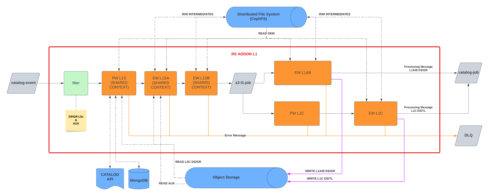

:arrow_heading_up:
Go back to the
[Processing Sentinel 2 repository](../../README.md)
:arrow_heading_up:

---

# RS Addon - S2_L1

## Description

The S2_L1 addon consumes L0c products (datastrips and granules) to make L1 products.

## Release Note

See [Release Note](Release_Note.md).
